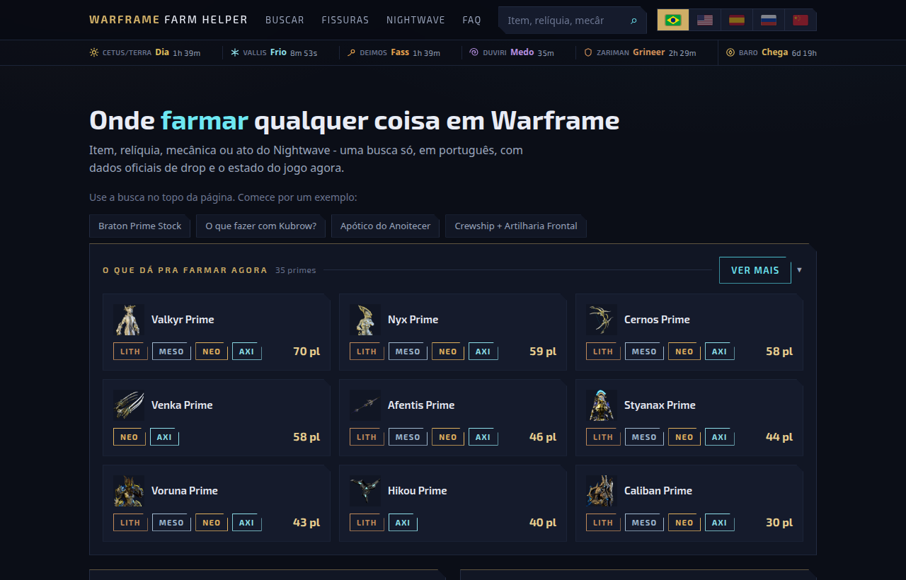
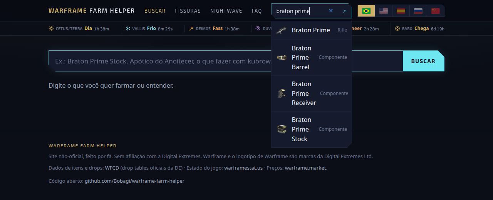
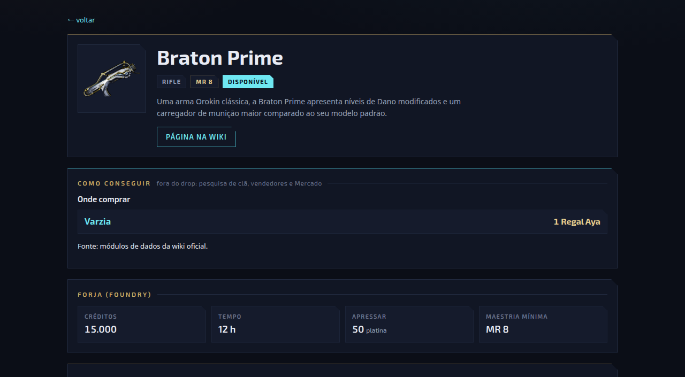
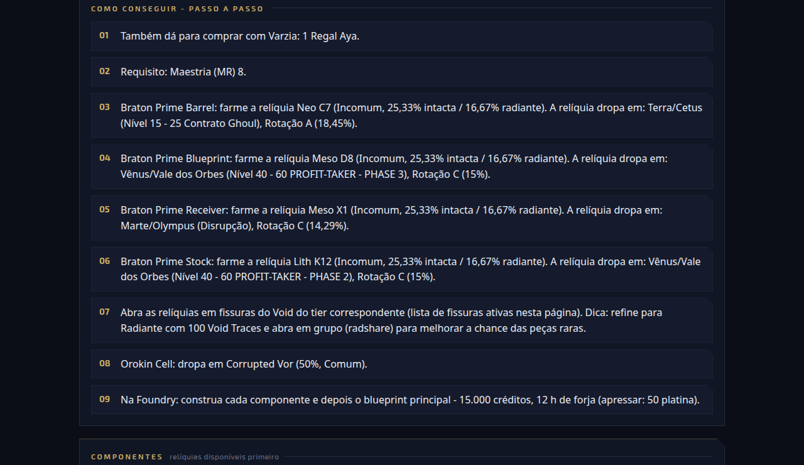
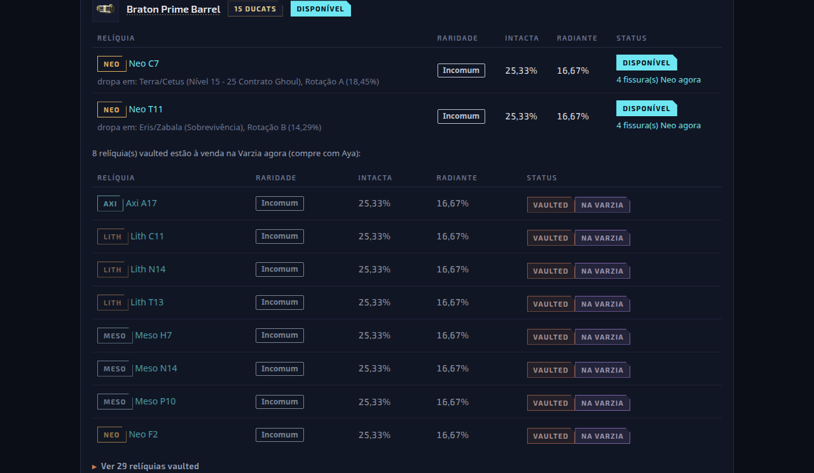
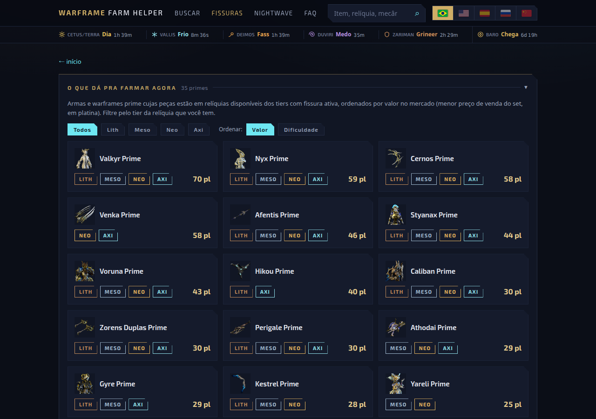
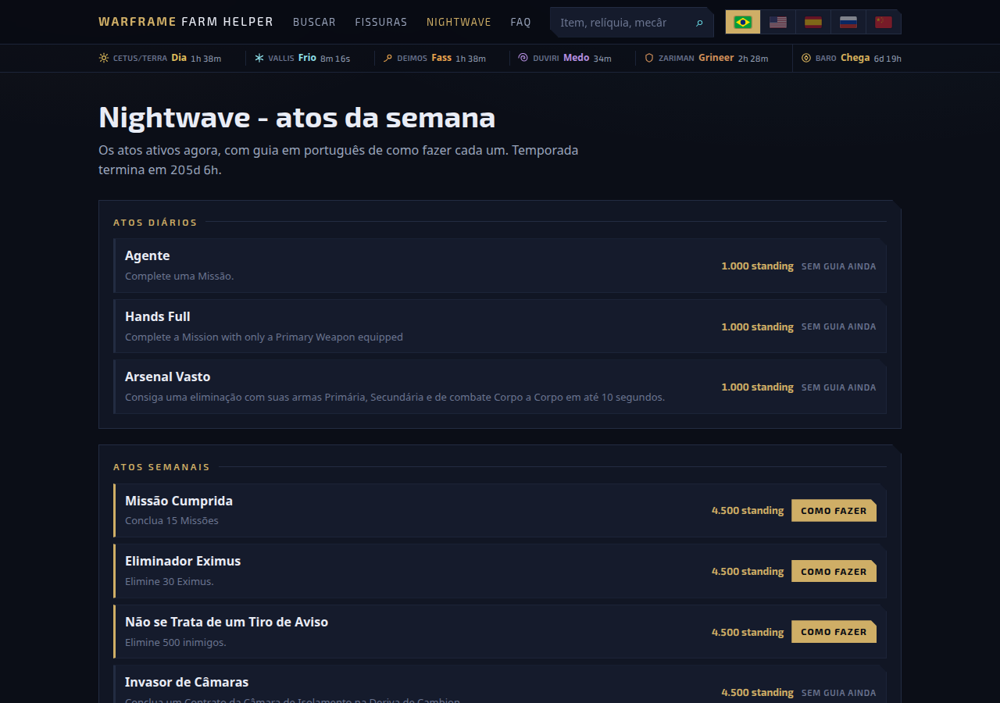
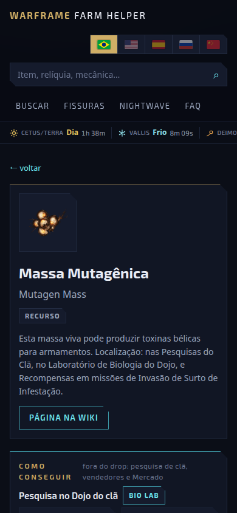
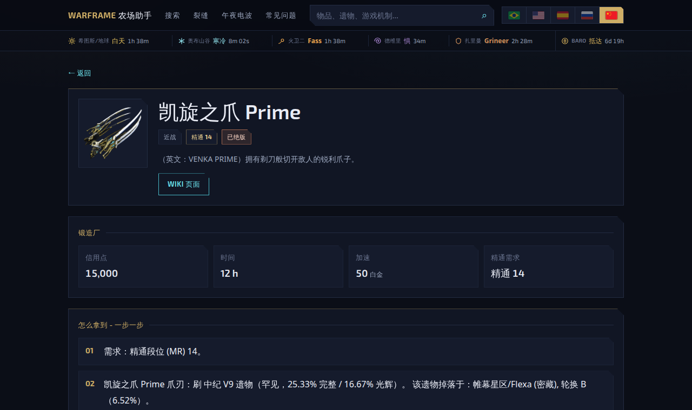

# Warframe Farm Helper

### Onde farmar qualquer coisa em Warframe, sem abrir cinco abas.

**[⮞ Abrir o site: warframe.bobagi.space](https://warframe.bobagi.space)**

Português · English · Español · Русский · 简体中文

## O problema

Você quer o Braton Prime. Aí começa: uma aba pra descobrir quais relíquias dropam cada peça, outra
pra saber se essas relíquias ainda dropam ou entraram no vault, outra pra ver se tem fissura do tier
certo ativa agora, e mais uma pro preço em platina. Quando você junta tudo, já esqueceu o que estava
fazendo.

Este site responde tudo isso em uma busca só.

## Digite o que você quer

Item, peça, relíquia, recurso, mecânica do jogo ou ato do Nightwave. A busca aceita português e
inglês misturados, perdoa erro de digitação e não liga pra acento.

## E ele te diz o caminho inteiro

Não é uma tabela de drop crua. É a resposta na ordem em que você vai executar: onde comprar o
projeto, quanto custa a forja, e o que fazer primeiro.

## Relíquia disponível ou vaulted, sem adivinhação

A parte que mais dá dor de cabeça. Cada peça mostra as relíquias que **ainda dropam** em cima, com a
chance intacta e radiante e quantas fissuras daquele tier estão abertas neste momento. As vaulted
ficam separadas, e as que voltaram na Prime Resurgence aparecem marcadas **na Varzia**, porque essas
você consegue hoje, com Aya.

## O estado do jogo, agora

As fissuras abertas neste minuto, com contagem regressiva, separadas em normais, Steel Path e Railjack. Os ciclos de Cetus, Vallis, Deimos, Duviri e Zariman ficam fixos no topo de todas as
páginas, junto com o Baro.

## Nightwave explicado, ato por ato

Os atos ativos da semana, cada um com um guia de como fazer. Inclusive os que ninguém explica
direito: destruir Crewship com a Artilharia Frontal, os enigmas do Duviri, os guardiões Necramech
dos vaults.

## Cabe no celular

Que é onde você vai olhar, com o jogo aberto na outra tela.

  

## Cinco idiomas, e o chinês é de verdade

Troque pela bandeira no topo. Quem abre da China, Taiwan, Hong Kong, Macau ou Singapura já cai em
chinês direto.

No chinês os nomes vêm da nomenclatura oficial do cliente CN, não de tradução automática: o site
diz 突变原聚合物, não "Mutagen Mass". A busca também funciona em chinês, os artigos foram traduzidos
e a tipografia foi ajustada pra escrita CJK.

## Também tem

- **FAQ de mecânica**: o que fazer com arma que não usa mais, quando gastar Forma e potato, como
  conseguir platina sem pagar, o que é Steel Path, ducats e Baro, e mais uns quinze.
- **Onde farmar recurso**, não só peça prime: Neurodes, Espinobre, Archon Shard, moeda de sindicato.
- **Pesquisa do Dojo**: qual laboratório, quanto custa e quais materiais, pra tudo que se pesquisa
  no clã.
- **Preço em platina** do warframe.market na página do item, pra você decidir entre farmar e comprar.
- Funciona **sem cadastro, sem login e sem cookie de rastreio**.

## De onde vêm os dados

- **Itens e drops**: [WFCD/warframe-items](https://github.com/WFCD/warframe-items), que empacota as
  drop tables oficiais da Digital Extremes. Reingerido todo dia.
- **Pesquisa de clã, vendedores e Mercado**: módulos de dados da wiki oficial.
- **Estado do jogo** (fissuras, Nightwave, Baro, ciclos, Varzia): [warframestat.us](https://api.warframestat.us),
  consultado a cada acesso.
- **Preços**: [warframe.market](https://warframe.market).

## Achou algo errado?

Drop que mudou, tradução esquisita, item que não aparece na busca:
[abra uma issue](https://github.com/Bobagi/warframe-farm-helper/issues). O pedido de suporte a
chinês veio assim.

## Para desenvolvedores

Como rodar, atualizar os dados e fazer deploy: **[docs/DEV.md](docs/DEV.md)**.

Node 22, Express, SQLite e front vanilla sem framework. Roda inteiro em um container.

## Licença e aviso

MIT, ver [LICENSE](LICENSE).

Site não oficial, feito por fã. Sem afiliação com a Digital Extremes. Warframe e o logotipo de
Warframe são marcas da Digital Extremes Ltd.
